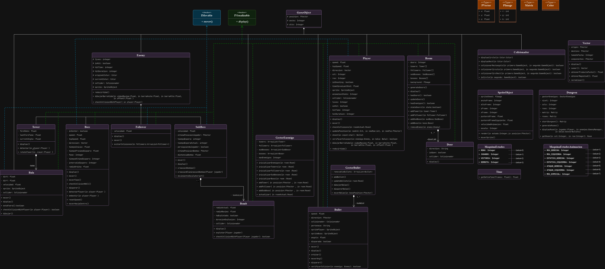
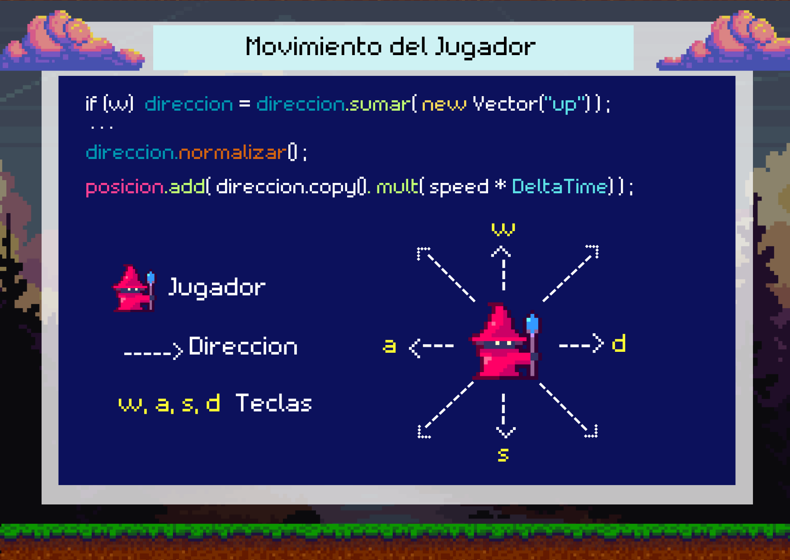
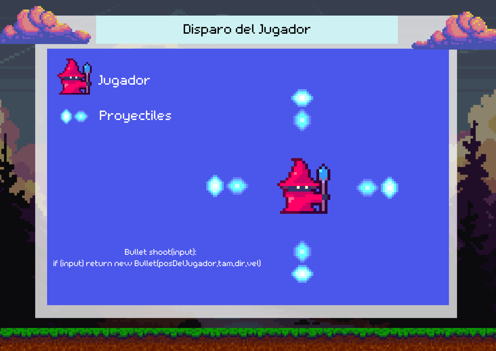
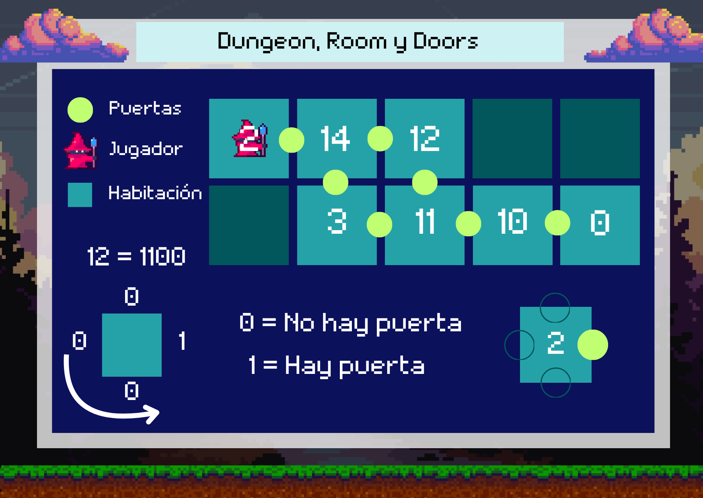
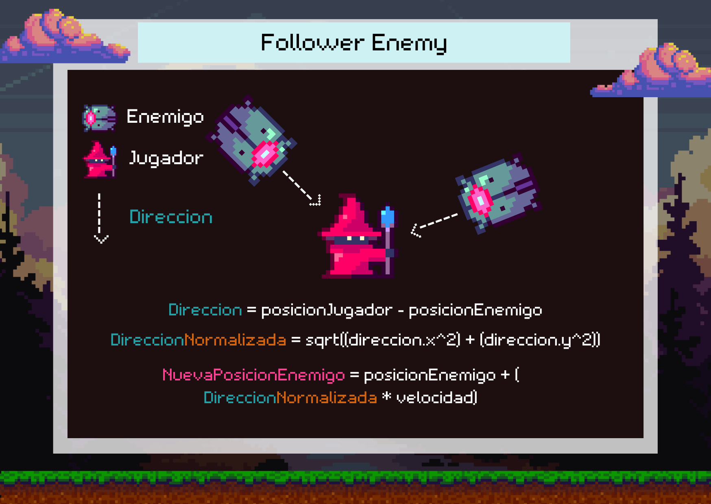
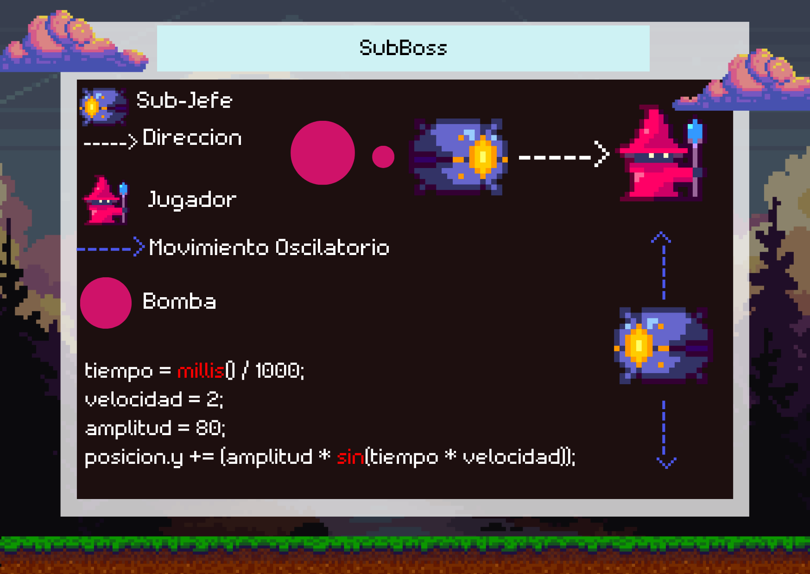
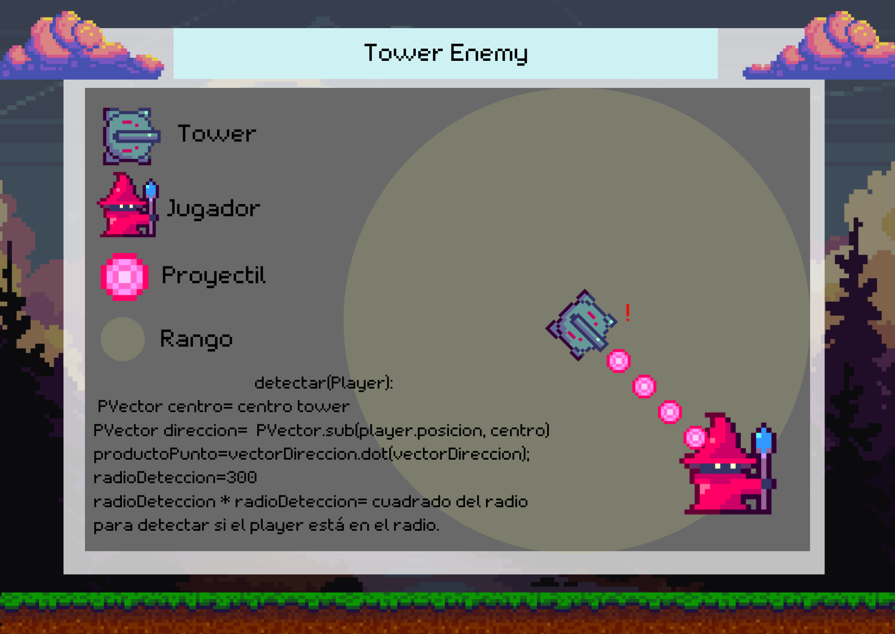
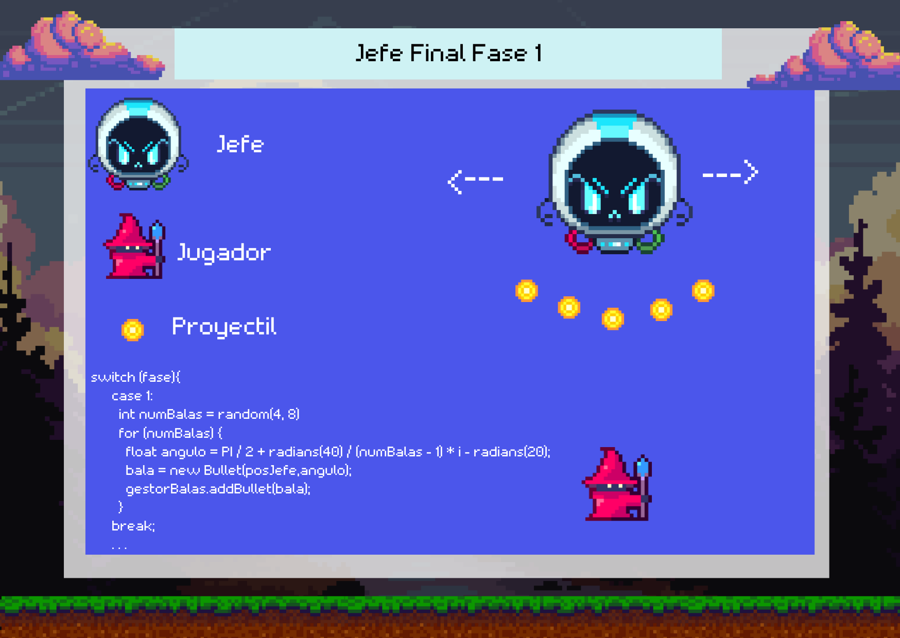
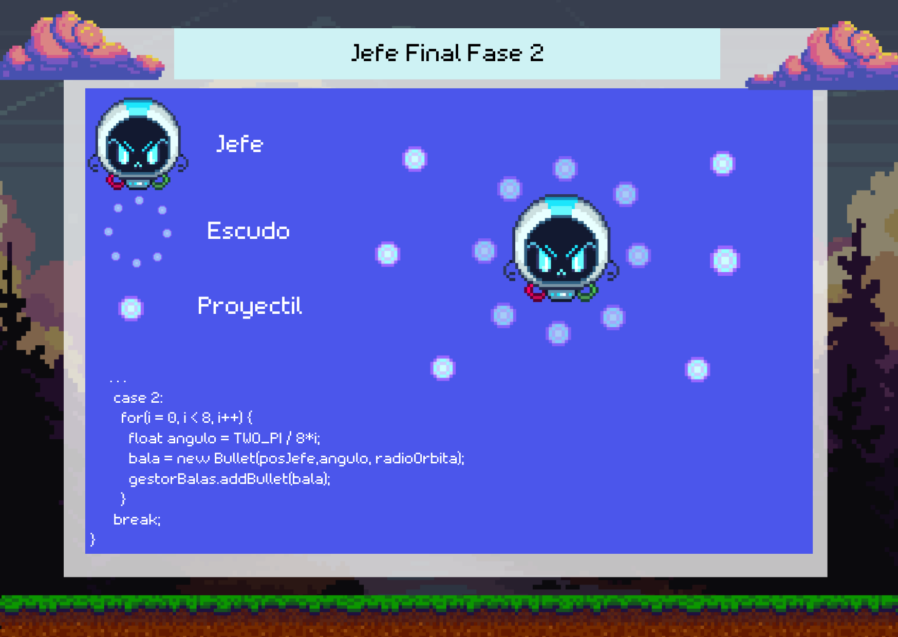

# MagIA - Juego desarrollado en Processing

  MagIA es un juego roguelike de acción y aventura, desarrollado por el grupo Desestima2 como parte del proyecto final para la materia Planeamiento de Mecánicas y Dinámicas de Juegos en la Tecnicatura Universitaria en Desarrollo Integral de Videojuegos FIUNJU.
  
  El juego lleva a los jugadores a explorar y limpiar habitaciones llenas de enemigos con el objetivo de avanzar hasta el enfrentamiento con el Jefe Final.

## Link de descarga

[Descargar por Google Drive](https://drive.google.com/drive/folders/1SSDek47nh3VaGA3BW1ag3nB9bgXHwsbc?usp=sharing)

## Gameplay

## Integrantes del Grupo

- Joaquín Amaru Segovia / TUV000684 / 44645340
- Ismael Ignacio Miguel Torres / TUV000095 / 44125517
- Cristian Javier Arraya Quispe / TUV000651 / 46472328
- Milagros Nahir Sosa / TUV000500 / 44645934
- Azul Argentina Brito / TUV000105 / 44773907

## Diagrama de Clases

## Historias de Usuario

[Click aquí para las historias de usuario](https://github.com/users/AmaruSegovia/projects/1/views/1)

Para ver todas las historias de usuario utilizadas en este proyecto, también puedes consultar el [PDF aquí](./data/HUMagIA.pdf).

## Mecanicas del Juego

---

© 2024 Desestima2. Todos los derechos reservados.
