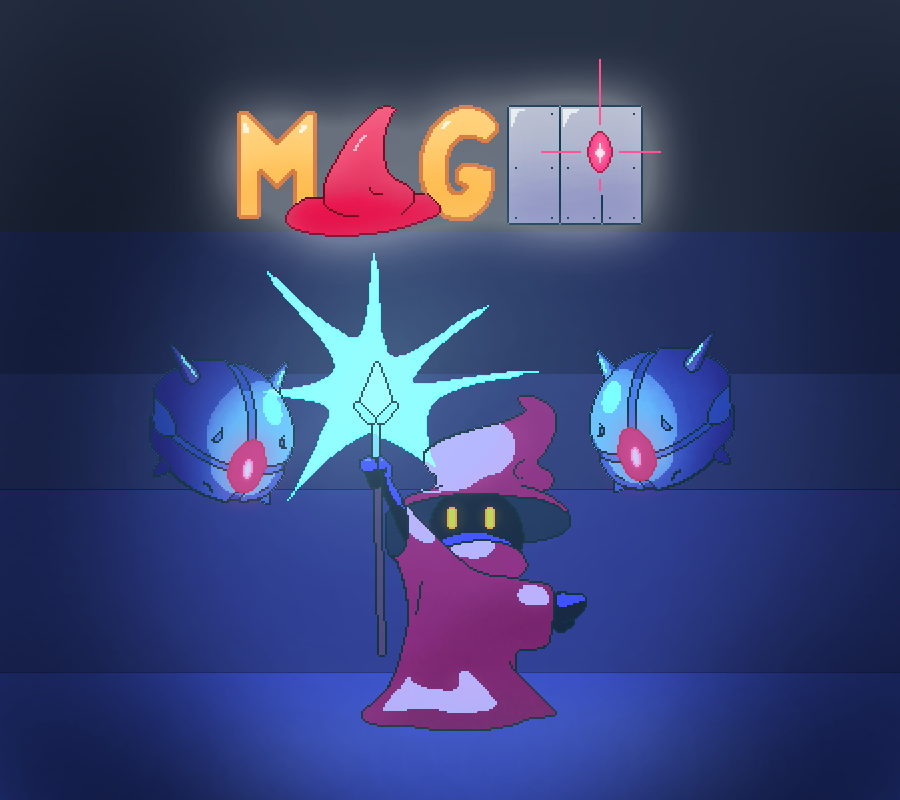

# MagIA - Juego desarrollado en Processing

MagIA es un juego desarrollado por el grupo Desestima2 como parte de un proyecto final en Processing para la Tecnicatura Universitario en Desarrollo Integral de Videojuegos.
El juego es un roguelike de acción y aventura, consta de habitaciones que el jugador explorar y vaciar para avanzar hasta enfrentarse al Jefe Final .

## Integrantes del Grupo

- Joaquín Amaru Segovia / TUV000684 / 44645340
- Ismael Ignacio Miguel Torres / TUV000095 / 44125517
- Cristian Javier Arraya Quispe / TUV000651 / 46472328
- Milagros Nahir Sosa / TUV000500 / 44645934
- Azul Argentina Brito / TUV000105 / 44773907

## Diagrama de Clases

## Historias de Usuario

[Click aquí para las historias de usuario](https://github.com/users/AmaruSegovia/projects/1/views/1)

Para ver todas las historias de Usuario usadas en este proyecto también puedes consultar el [PDF aquí](./data/HUMagIA.pdf).

---

© 2024 Desestima2. Todos los derechos reservados.
